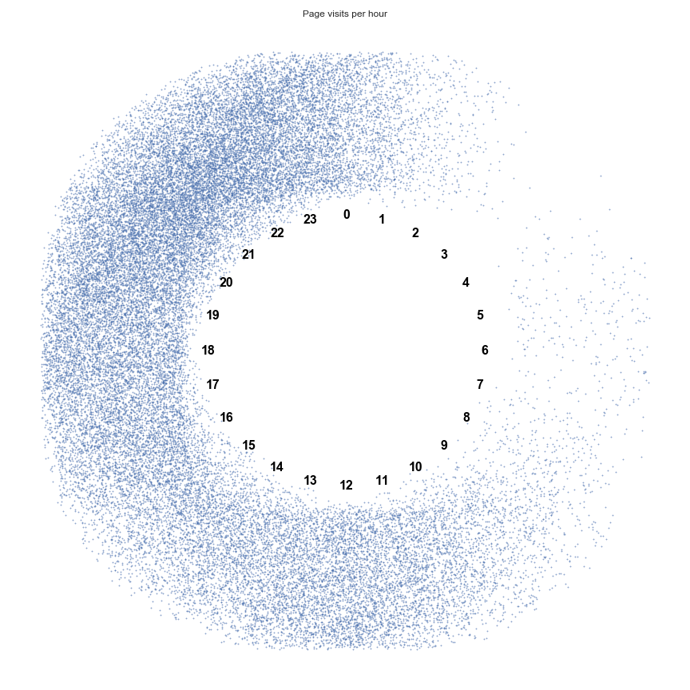

# Analyzing the Google Chrome history
I minimally adapted the code from [this blogpost](https://applecrazy.github.io/blog/posts/analyzing-browser-hist-using-python/) by **AppleCrazy**. Thanks a lot for sharing!

## Instructions
```shell
git clone git@github.com:davidgengenbach/chrome_history.git
cd chrome_history

pip install -r requirements.txt

# Depending on which system you are worknig, you might have to adapt the paths in this file
./get_chrome_history.sh

jupyter notebook

# And open the analize_chrome_history notebook
```

